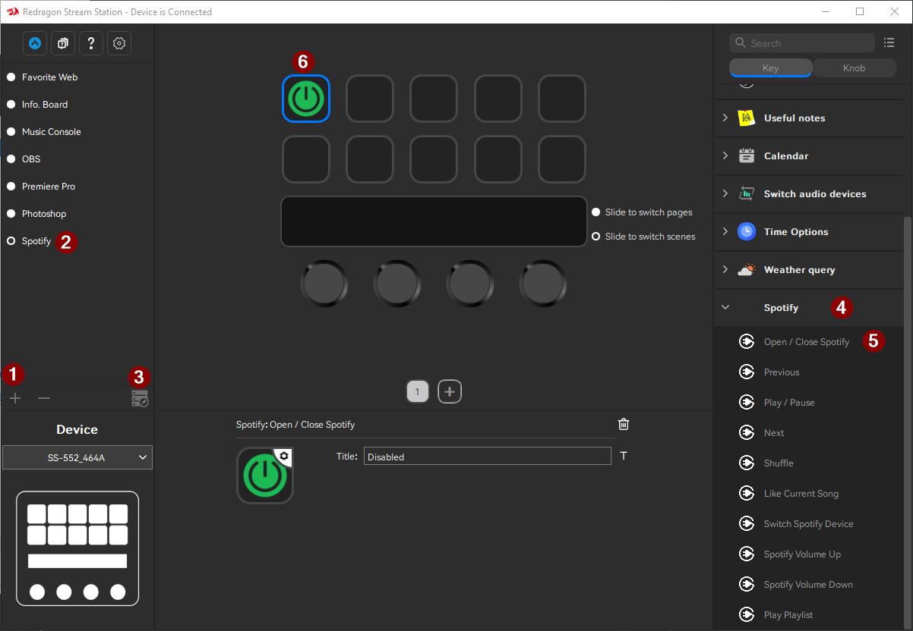

# Spotify Control for Redragon SS-552 / StreamDock

Control Spotify from a Redragon SS-552 or StreamDock-compatible device, including Spotify Connect speakers.

This plugin adds buttons for playback, liked songs, playlists, device switching, active Spotify-device volume, and a now-playing display. It uses a small local Windows helper so the StreamDock plugin can talk to Spotify safely.

## Screenshots

Screenshots and GIFs coming soon.

- Main Spotify action grid placeholder
- Now Playing display placeholder
- Playlist selector placeholder
- Device volume / device switch placeholder

## Features

- Open or close Spotify
- Play / pause
- Previous / next track
- Toggle shuffle
- Like or unlike the current song
- Show the current track and artist
- Cycle configured playlists and hold to play
- Switch between available Spotify playback devices
- Control the active Spotify device volume, including Spotify Connect speakers
- Rename Spotify devices locally when Spotify reports an ID-like name

## Supported Hardware

- Redragon SS-552
- HotSpot StreamDock
- StreamDock-compatible devices that support the same plugin format

This project is Windows-focused.

## Download

Download the latest release zip from this repository's GitHub Releases page.

Use the zip named like:

```text
redragon-ss552-spotify-control-vX.X.X.zip
```

## Quick Install

1. Download and unzip the release.
2. Close StreamDock.
3. Copy:

```text
com.sonic.spotifycontrol.sdPlugin
```

into:

```text
C:\Users\<YOUR_USER>\AppData\Roaming\HotSpot\StreamDock\plugins\
```

4. Start StreamDock again.
5. Open the release `helper` folder.
6. Double-click:

```text
start-helper.bat
```

The helper runs in the background. You do not need to keep a terminal open.

## Spotify Setup

The helper needs a Spotify Client ID. It does not use a client secret.

1. Go to the Spotify Developer Dashboard: https://developer.spotify.com/dashboard
2. Create an app.
3. In the app settings, add this redirect URI exactly:

```text
http://127.0.0.1:53999/callback
```

4. Copy the app's Client ID.
5. Run `helper\start-helper.bat`.
6. If this is your first run, `config.local.json` opens in Notepad.
7. Paste your Client ID into `spotifyClientId`, save, and run `start-helper.bat` again.
8. Open:

```text
http://127.0.0.1:53999/login
```

9. Approve Spotify access.
10. Open Spotify desktop and start any song once so Spotify has an active playback device.

## Basic Usage: Add Buttons in StreamDock

After installing the plugin, starting the helper, and logging in to Spotify, add the Spotify actions to your SS-552 buttons one at a time. StreamDock does not place the buttons automatically.

1. Open the StreamDock app.
2. Create a new scene/profile, or select the scene/profile you want to use.
3. Find the actions sidebar in StreamDock.
4. Look for the Spotify plugin category in the actions sidebar.
5. Drag one Spotify action onto an empty SS-552 key on the scene/profile grid.
6. Repeat that for each Spotify button you want to add.
7. Click a configured key in StreamDock to edit that key's settings in the property inspector.
8. If you added the `Playlist` action, click that Playlist key and configure playlists in its property inspector.
9. Press the physical keys on the SS-552 to control Spotify.

Each action is added individually. For example, dragging `Play/Pause` onto one key only creates the play/pause button; drag `Next Track`, `Playlist`, `Like Current Song`, and the other actions onto their own keys too.

Example SS-552 layout:

```text
Power | Previous | Play/Pause | Next | Shuffle
Like  | Playlist | Now Playing | Device | Vol+/Vol-
```

Screenshots:

- 1. Create a scene (profile) 2. select ti 3. edit and rename 4. Expand 5. Drag to a slot

- Playlist configuration in the property inspector
- Example SS-552 Spotify layout

Available actions:

- `Open/Close Spotify`
- `Previous Track`
- `Play/Pause`
- `Next Track`
- `Shuffle`
- `Like Current Song`
- `Now Playing`
- `Playlist`
- `Switch Spotify Device`
- `Spotify Volume Up`
- `Spotify Volume Down`

The `Switch Spotify Device` button cycles playback between available Spotify devices, such as your PC, phone, WiiM player, Google speaker, or other Spotify Connect devices.

The `Spotify Volume Up` and `Spotify Volume Down` buttons control the active Spotify playback device volume. They do not control Windows desktop volume.

## Playlists

Playlist setup happens inside the Playlist key's property inspector.

1. Open StreamDock.
2. Select your scene/profile.
3. Drag the `Playlist` action onto a key.
4. Click that configured Playlist key.
5. In the property inspector, find the playlist text box.
6. Enter one playlist per line using this format:

```text
Button Name | Spotify playlist link
```

Example:

```text
Chill Mix | https://open.spotify.com/playlist/PASTE_PLAYLIST_LINK_HERE
Workout | https://open.spotify.com/playlist/PASTE_ANOTHER_PLAYLIST_LINK_HERE
```

To get a playlist link:

1. Open Spotify.
2. Right-click a playlist.
3. Choose Share.
4. Choose Copy link to playlist.
5. Paste it after `Name |` in the playlist box.

Playlist button behavior:

- Tap the Playlist key to cycle through your configured playlists.
- Hold the Playlist key for about half a second to play the currently selected playlist.

## Auto-Start

To start the helper automatically when Windows starts, run:

```text
helper\install-autostart.bat
```

To remove auto-start, run:

```text
helper\uninstall-autostart.bat
```

## Rename Devices

Some Spotify Connect devices show an ID-like name. You can rename them locally.

Edit:

```text
helper\config.local.json
```

Example:

```json
{
  "spotifyClientId": "your-client-id",
  "deviceNames": {
    "paste-your-spotify-device-id-here": "Living Room Speaker"
  }
}
```

Restart the helper after editing.

## Troubleshooting

### Helper not running

Open:

```text
http://127.0.0.1:53999/api/status
```

If the page does not load, run:

```text
helper\start-helper.bat
```

### Spotify not authenticated

Open:

```text
http://127.0.0.1:53999/login
```

Approve access again.

### No active Spotify device

Open Spotify desktop and start any song once. Spotify Web API controls need an active playback device.

### Device volume does not change

Some Spotify Connect devices do not expose volume control through Spotify. Try switching Spotify playback to the device first, then press the Spotify Volume buttons again.

### Playlist returns 404

Some personalized Spotify-made playlists, including Discover Weekly and Release Radar, can return 404 from Spotify's Web API even when the Spotify app can show them. The helper keeps those playlists visible and still tries playback when selected.

Try opening the playlist in Spotify, following or saving it if possible, copying the link again, and pasting the new link into the playlist box.

## More Documentation

- End-user release guide: [docs/INSTALL.md](docs/INSTALL.md)
- Developer notes and endpoint tests: [docs/DEVELOPER.md](docs/DEVELOPER.md)
